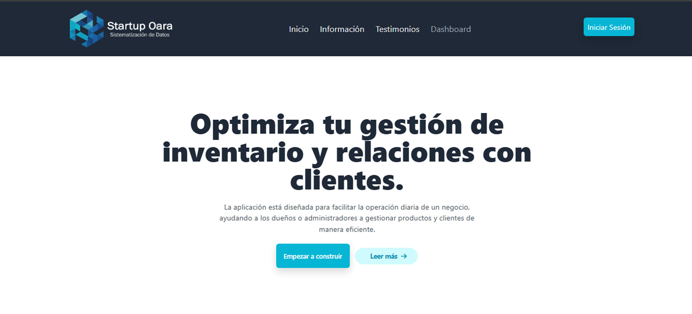
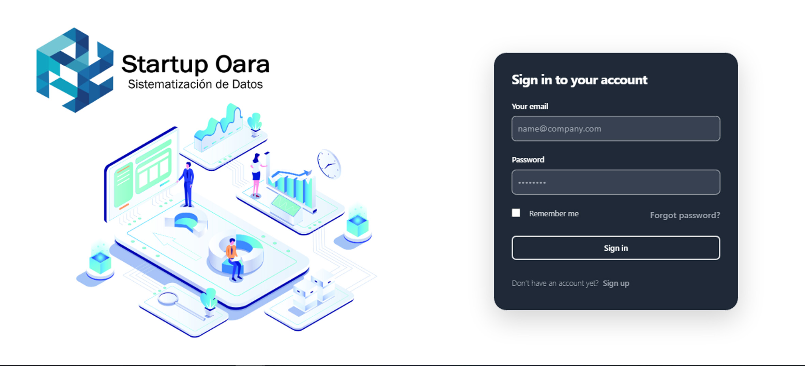
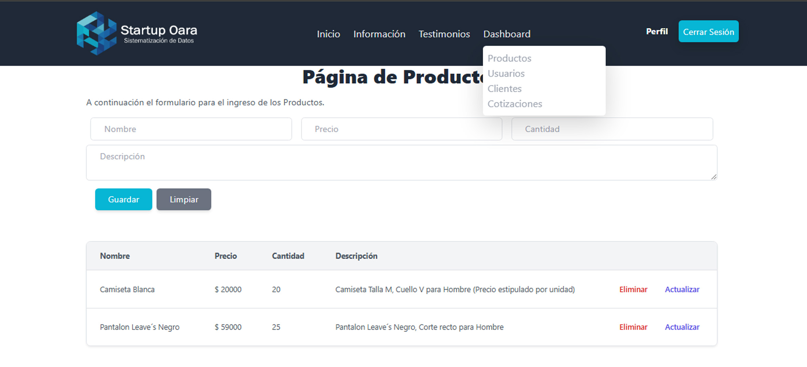
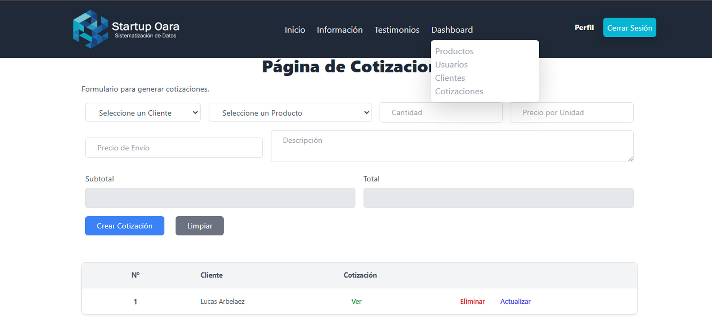
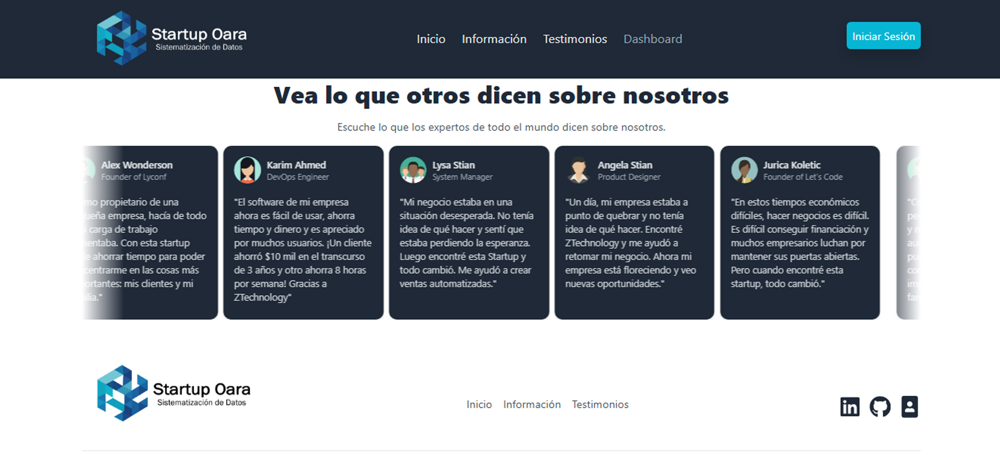

# ZTechnologyCRM (StartUp - OARA) - Frontend

Optimiza tu gestión de inventario y relaciones con clientes.
La aplicación está diseñada para facilitar la operación diaria de un negocio, ayudando a los dueños o administradores a gestionar productos y clientes de manera eficiente.

## Características

- Autenticación de usuarios.
- Optimización de reportes: Mejora el control sobre tu inventario mientras ofreces una experiencia de cliente más personalizada.
- Elimina cargas innecesarias: Automatiza tareas repetitivas y reduce la carga administrativa maximizando la productividad.
- Posee y controla tus datos: La seguridad de tus datos es nuestra prioridad, brindándote total control sobre ellos.
- Analiza Clientes Potenciales: Te ayudamos a identificar y comprender mejor a los clientes potenciales.

## Explora las funciones que ofrecemos

- Gestión de usuarios
- Gestión de productos
- Gestión de clientes
- Seguimiento de ventas

## Tecnologías utilizadas

- **React**: Biblioteca para la creación de interfaces de usuario.
- **Tailwind CSS**: Framework CSS para el diseño responsivo y personalización de estilos.
- **Supabase**: Autenticación con OAuth para iniciar sesión con Google.
- **Fetch API**: Para las llamadas al backend.

## Scripts Disponibles

## Vista para la autenticación de usuarios

## Vista para la funcionalidad de la web

## Vista para los testimonios

## Contribuciones

Las contribuciones son bienvenidas.

## Visitar sitio web 

https://ztechnology-oara.netlify.app/
